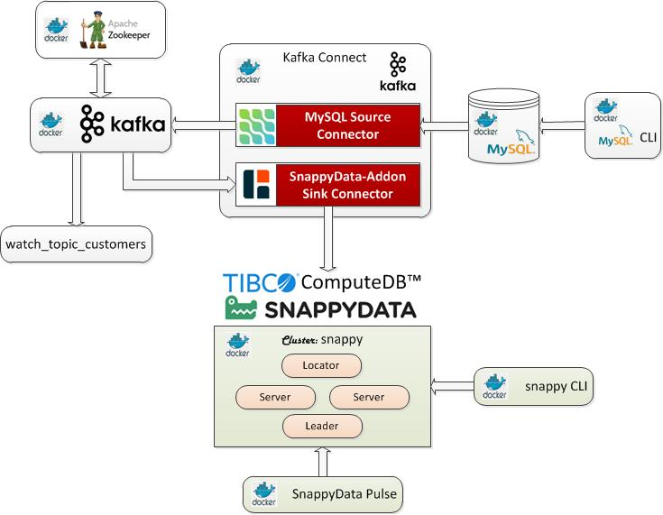
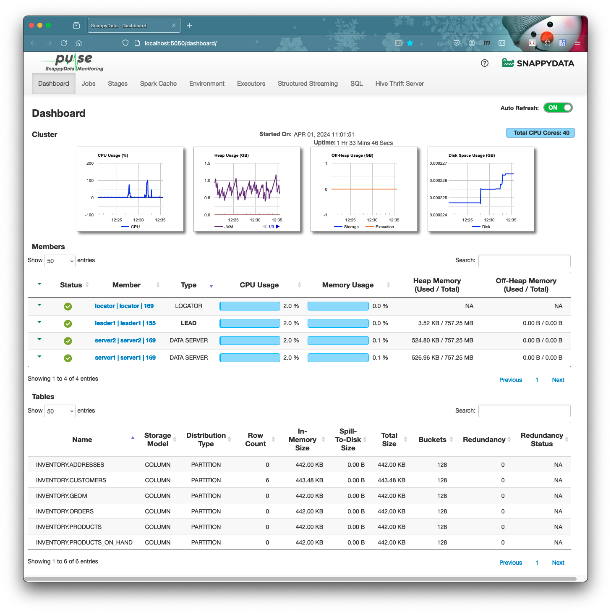

 [*PadoGrid*](https://github.com/padogrid) | [*Catalogs*](https://github.com/padogrid/catalog-bundles/blob/master/all-catalog.md) | [*Manual*](https://github.com/padogrid/padogrid/wiki) | [*FAQ*](https://github.com/padogrid/padogrid/wiki/faq) | [*Releases*](https://github.com/padogrid/padogrid/releases) | [*Templates*](https://github.com/padogrid/padogrid/wiki/Using-Bundle-Templates) | [*Pods*](https://github.com/padogrid/padogrid/wiki/Understanding-Padogrid-Pods) | [*Kubernetes*](https://github.com/padogrid/padogrid/wiki/Kubernetes) | [*Docker*](https://github.com/padogrid/padogrid/wiki/Docker) | [*Apps*](https://github.com/padogrid/padogrid/wiki/Apps) | [*Quick Start*](https://github.com/padogrid/padogrid/wiki/Quick-Start)

---

<!-- Platforms -->
[](https://github.com/padogrid/padogrid/wiki/Platform-PadoGrid-1.x) [](https://github.com/padogrid/padogrid/wiki/Platform-Host-OS) [](https://github.com/padogrid/padogrid/wiki/Platform-Docker) 

# Debezium-Kafka SnappyData/ComputeDB Connector

This bundle integrates SnappyData/ComputeDB with Debezium for ingesting initial data and CDC records from MySQL into a SnappyData/ComputeDB cluster via a Kafka sink connector included in the `padogrid` distribution. It supports inserts, updates and deletes.

## Installing Bundle

```console
install_bundle -download bundle-snappydata-1-docker-debezium_kafka
```

❗️ If you are running this demo on WSL, make sure your workspace is on a shared folder. The Docker volume it creates will not be visible otherwise.

## Use Case

This use case ingests data changes made in the MySQL database into SnappyData/ComputeDB cluster via Kafka connectors: the Debezium MySQL source connector and the `snappydata-addon` Debezium sink connector.



## Required Software

- Docker
- Maven 3.x

## Optional Software

- jq

## Debezium Tutorial

The demo follows the Debezium Totorial steps shown in the link below.

<https://debezium.io/documentation/reference/2.3/tutorial.html#registering-connector-monitor-inventory-database>

All the commands provided in the tutorial are wrapped in the scripts found in the `bin_sh` directory. We'll use these scripts to simplify the demo.

## Building Demo

✏️  *This bundle builds the demo enviroment based on the SnappyData version in your workspace. Make sure your workspace has been configured with the desired versions before building the demo environment.*

First, change your cluster context to a SnappyData cluster. This is required in order to configure the SnappyData Docker containers.

 Terminal SnappyData

```bash
# Create a SnappyData cluster if it does not already exist.
create_cluster -product snappydata

# Switch context
switch_cluster mysnappy
```

Now, build the demo by running the `build_app` command as shown below. This command performs the folliwing operations.

- Downloads the SnappyData/ComputeDB JDBC driver jar file and places it in the `padogrid/lib` directory, which is mounted as a Docker volume.
- Places the `snappydata-addon-common` and `snappydata-addon-core` jar files in `padogrid/lib` directory so that the SnappyData/ComputeDB Debezium Kafka connector can include them in its class path.
- Places the `create_inventory_*.sql` files found in the `bin_sh` directory in the SnappyData cluster's `padogrid/etc/` directory so that we can create the tables in the SnappyData cluster later in the demo.

❗️ If you created a SnappyData/ComputeDB cluster in the previous section with a cluster name other than `snappy` then you must enter that name in the `setenv.sh` file.

 Terminal SnappyData

```bash
cd_docker debezium_kafka/bin_sh
vi setenv.sh
```

In the `setenv.sh` file change the cluster name as needed.

```bash
# Change snappy to your cluster name
SNAPPYDATA_CLUSTER_NAME="snappy"
```

Run the `build_app` command to build the Debezium Docker environment.

```bash
cd_docker debezium_kafka/bin_sh
./build_app
```

Upon successful build, the `padogrid` directory should have jar files similar to the following:

 Terminal SnappyData

```console
cd_docker debezium_kafka
tree padogrid
```

**Output:**

```console
padogrid
└── lib
    ├── padogrid-common-1.0.0.jar
    ├── snappydata-addon-core-1.0.0.jar
    └── snappydata-jdbc_2.11-1.2.0.jar
```

## Creating `my_network`

Let's create the `my_network` network to which all containers will join.

 Terminal SnappyData

```bash
docker network create my_network
```

## Creating SnappyData/ComputeDB Docker Containers

Let's create a SnappyData cluster to run on Docker containers with the `my_network` network we created in the previous section.

 Terminal SnappyData

```console
create_docker -product snappydata -cluster snappy -network my_network
cd_docker snappy
```

The `snappy` cluster's `padogrid` directory should look similar to the following:

```bash
cd_docker snappy
tree padogrid
```

**Output:**

```console
padogrid
├── etc
│   ├── gemfirexd.properties
│   ├── log4j2.properties
│   └── prometheus.yml
├── lib
│   ├── bcpkix-jdk18on-1.74.jar
│   ├── bcprov-jdk18on-1.74.jar
│   ├── cache-api-1.1.1.jar
│   ├── jmx_prometheus_javaagent-0.17.2.jar
│   ├── json-20230227.jar
│   ├── kryo-4.0.0.jar
│   ├── log4j-api-2.19.0.jar
│   ├── log4j-core-2.19.0.jar
│   ├── log4j-slf4j-impl-2.19.0.jar
│   ├── org.eclipse.paho.client.mqttv3-1.2.5.jar
│   ├── org.eclipse.paho.mqttv5.client-1.2.5.jar
│   ├── padogrid-common-1.0.0.jar
│   ├── padogrid-snappydata-all-1.0.0.jar
│   ├── padogrid-tools-1.0.0.jar
│   ├── slf4j-api-1.7.25.jar
│   ├── snakeyaml-1.23.jar
│   └── snappydata-addon-core-1.0.0.jar
├── log
├── plugins
│   └── snappydata-addon-core-1.0.0-tests.jar
├── run
└── stats
```

## Starting Docker Containers

There are numerous Docker containers to this demo. We'll first start the SnappyData/ComputeDB cluster containers and then proceed with the Debezium containers. By default, the scripts provided run the containers in the foreground so that you can view the log events. You will need to launch a total of eight (8) terminals. If you have a screen splitter such as Windows Terminal, it will make things easier.


You can also run some of the scripts in the background by including the '-d' option. These scripts are mentioned below.

### Start SnappyData/ComputeDB Containers

Start the `snappy` SnappyData/ComputeDB cluster containers.

 Terminal SnappyData

```console
cd_docker snappy
docker compose up
```

### Create Tables in SnappyData/ComputeDB

Once the `snappy` Docker containers are up, you need to create the `inventory` schema and tables as follows.

 Terminal Driver

```bash
cd_docker debezium_kafka/bin_sh
./create_inventory_schema
./create_inventory_tables
```

### Start Debezium Containers

 Terminal 1-6

Launch six (6) terminals and run each script from their own terminal as shown below. Each script must be run from their own terminal as they will block and display log messages.


```bash
cd_docker debezium_kafka/bin_sh

# 1. Start Zookeeper (include '-d' to run it in the background)
./start_zookeeper

# 2. Start Kafka (include '-d' to run it in the background)
./start_kafka

# 3. Start MySQL database (include '-d' to run it in the background)
./start_mysql

# 4. Start Kafka Connect (include '-d' to run it in the background)
./start_kafka_connect

# 5. Start topic watcher
./watch_topic_customers

# 6. Start MySQL CLI
./start_mysql_cli
```

### Register Kafka Connect via REST API

There are two (2) Kafka connectors that we must register. The MySQL connector is provided by Debezium and the SnappyData/ComputeDB connector is part of the PadoGrid distribution. 

 Terminal Driver

```bash
cd_docker debezium_kafka/bin_sh
./register_mysql_connector
./register_debezium_snappydata_connector
```

### Check Kafka Connect

 Terminal Driver

```bash
# Check status
curl -Ss -H "Accept:application/json" localhost:8083/ | jq

# List registered connectors 
curl -Ss -H "Accept:application/json" localhost:8083/connectors/ | jq
```

The last command should display the inventory connector that we registered previously.

```json
[
  "debezium-snappydata-sink",
  "inventory-connector"
]
```

### MySQL CLI

Using the MySQL CLI, you can change table contents. The changes you make will be captured in the form of change events by the Debezium source connector. The SnappyData/ComputeDB sink connector in turn receives the change events and updates (or deletes) the assigned table, i.e., `inventory.customers`.

 Terminal 6

```console
use inventory;
SELECT * FROM customers;
UPDATE customers SET first_name='Anne Marie' WHERE id=1004;
-- Delete - First, delete the row in addresses that references the foreign key
DELETE FROM addresses WHERE customer_id=1004;
DELETE FROM customers WHERE id=1004;

INSERT INTO customers VALUES (default, "Sarah", "Thompson", "kitt@acme.com");
INSERT INTO customers VALUES (default, "Kenneth", "Anderson", "kander@acme.com");
```

### SnappyData/ComputeDB CLI

To view the table contents in SnappyData/ComputeDB, run the `start_snappydata_cli` command as follows:

 Terminal Driver

```bash
cd_docker debezium_kafka/bin_sh
./start_snappydata_cli
snappy> connect client 'locator:1527';
snappy> select * from inventory.customers;
```

### Monitor SnappyData/ComputeDB from Pulse

**Pulse URL:** http://localhost:5050



## Teardown

 Terminal Driver

```console
# Shutdown Debezium containers
cd_docker debezium_kafka/bin_sh
./cleanup

# Shutdown SnappyData/ComputeDB containers
cd_docker snappy
docker compose down

# Prune all stopped containers 
docker container prune -f
```

## Tips

### 1. When I run `start_mysql` I get the following error message.

```console
docker: Error response from daemon: Ports are not available: listen tcp 0.0.0.0:3306: bind: Only one usage of each socket address (protocol/network address/port) is normally permitted.
ERRO[0000] error waiting for container: context canceled
```

The above error occurs if you have MySQL already running locally in your host OS. The `mysql` Docker container listens on the same port number. You must stop the local MySQL instance and prune the containers before runngin `start_mysql` again.

```bash
# First, stop your local MySQL instance running in the host OS.

# Prune the containers
docker container prune -f

# Run start_mysql again
./start_mysql
```

---

 [*PadoGrid*](https://github.com/padogrid) | [*Catalogs*](https://github.com/padogrid/catalog-bundles/blob/master/all-catalog.md) | [*Manual*](https://github.com/padogrid/padogrid/wiki) | [*FAQ*](https://github.com/padogrid/padogrid/wiki/faq) | [*Releases*](https://github.com/padogrid/padogrid/releases) | [*Templates*](https://github.com/padogrid/padogrid/wiki/Using-Bundle-Templates) | [*Pods*](https://github.com/padogrid/padogrid/wiki/Understanding-Padogrid-Pods) | [*Kubernetes*](https://github.com/padogrid/padogrid/wiki/Kubernetes) | [*Docker*](https://github.com/padogrid/padogrid/wiki/Docker) | [*Apps*](https://github.com/padogrid/padogrid/wiki/Apps) | [*Quick Start*](https://github.com/padogrid/padogrid/wiki/Quick-Start)
